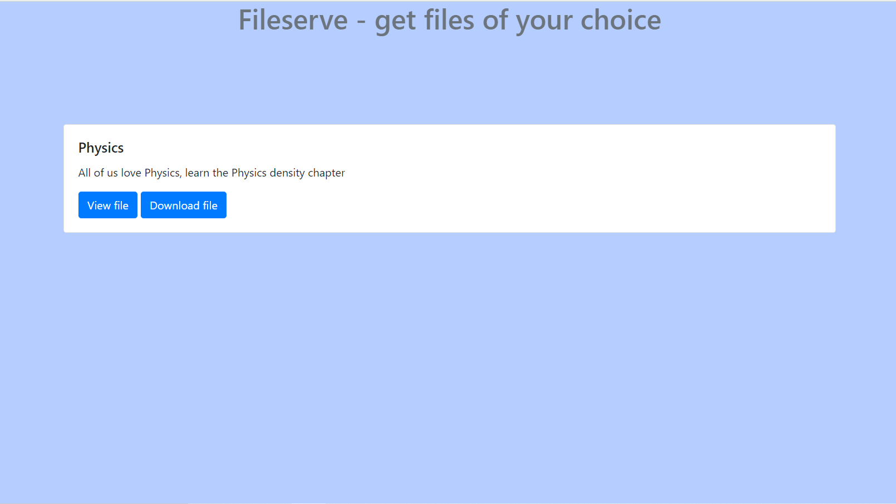

# FileServe

## Concept

This is a service which lets us download and view files using a simple interface made using ejs and bootstrap.

---

## The libraries used.

  1. @hapi/joi
  2. bcrypt
  3. cors
  4. ejs
  5. express
  6. express-fileupload
  7. jsonwebtoken
  8. lodash
  9. mongoose

---

## The initial process.

Get on to the terminal, and navigate to the folder,

type in `npm install`, and your folder will be initialized with `node_modules` folder.

create a file as `.env` in the directory, and enter `app_jwtPrivateKey=mySecureKey`, or name it as per your choice.

---

## how to use it?

### The endpoints

    / -> for the interface
    POST /admin/uploadFile -> To upload a file
    POST /admin/uploadDataForFile -> To upload data for a particular file
    PUT /admin/updateDataForFile -> To update data for a particular file
    POST /user/newUser -> To make a new user
    POST /auth/ -> To get the authentication token for a user

---

## The interface

<br>

</img>

## user route

    it just has one route.
  `POST` /user/newUser

  schema: 

```json
  {
    "name": "your name",
    "email": "your email",
    "password": "yourPassword"
  }
```

NOTE: if you want to set the user an admin, in mongodbCompass, set the `isAdmin` property to true.